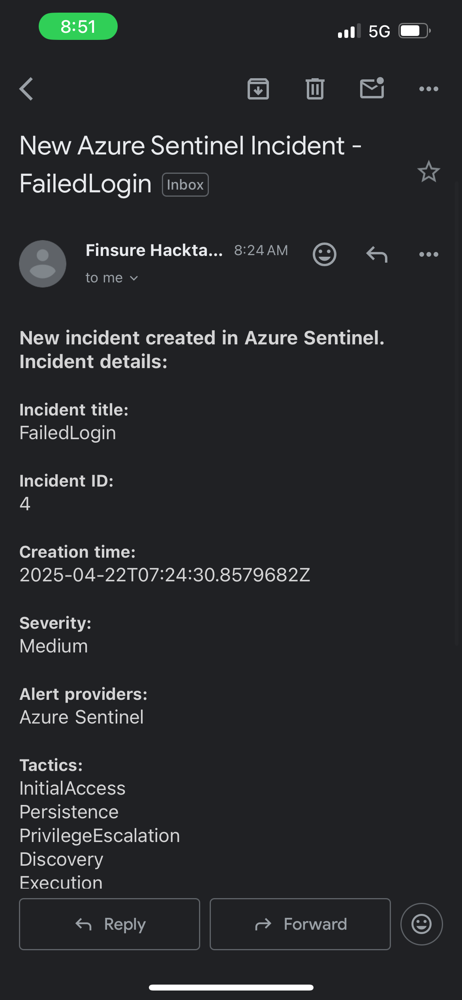

# Azure Sentinel SIEM and SOAR Implementation Project

## 📖 Overview
This project demonstrates the real-world implementation of Microsoft Sentinel for advanced threat detection, incident response, and security automation across a cloud environment.  
The environment integrated Azure resources (NSG, Firewall, MDE, Azure Activity Logs) and Microsoft 365 data. Custom detection rules and playbooks were developed to automate security operations based on identified threats.

## 🏗️ Environment Setup
- Microsoft Sentinel deployed on an Azure subscription.
- Data connectors installed and configured:
  - **NSG Flow Logs**
  - **Azure Firewall Logs**
  - **Microsoft Defender for Endpoint (MDE)**
  - **Azure Activity Logs**
  - **Microsoft 365 Defender**
- **Microsoft Entra ID** (formerly Azure AD) used for identity management and automation tasks.

## 🧩 Data Connectors Configuration
Each connector was configured to send telemetry to Microsoft Sentinel for continuous monitoring.

| Connector | Status | Purpose |
|-----------|--------|---------|
| NSG Flow Logs | Enabled | Monitor network traffic and anomalies |
| Azure Firewall Logs | Enabled | Capture firewall traffic logs |
| Microsoft Defender for Endpoint | Enabled | Endpoint detection and response data |
| Azure Activity Logs | Enabled | Monitor administrative activities |
| Microsoft 365 Defender | Enabled | Email, identity, and collaboration security |

 

📸 **Sentinel Data Connectors page:**  

## 🔍 Detection Rules Created (Custom Analytics Rules)
- **Failed Login Attempt Detection**
  - *KQL Query:* Custom query to detect multiple failed login attempts.
  - *Response:* Trigger a playbook to email the manager and reset the user's password.
  
- **Endpoint Malware Infection Detection**
  - Detect malware (e.g., 'Wacatac') infections on endpoints.
  
- **Brute Force Attack Detection Against Cloud PC**
  - Detect multiple failed sign-in attempts indicating a brute force attack.
  
- **User Assigned New Privileged Role Detection**
  - Alert when a user is assigned high-privilege roles like Global Admin.
  
- **Advanced Multistage Attack Detection**
  - Detect coordinated, multistep attacks based on correlated telemetry.
  
- **Suspicious Traffic Detection**
  - Detect unusual or unauthorized network communications based on NSG/Firewall logs.

 

📸 **Analytics Rules Overview:**  

## ⚙️ Automated Response (SOAR Playbooks)
For each detection rule, a corresponding Logic App Playbook was created to automate response:

| Detection Rule | Playbook Action |
|----------------|-----------------|
| Failed Login Attempts | Email manager + Reset Entra ID password |
| Malware Infection Detected  | Block Entra ID User immediately |
| Brute Force Attack Detected | Assign owner to incident + Block Entra ID user + Reset password |
| Suspicious Traffic Detected | Isolate machine + Alert SOC team |
| Privileged Role Assignment | Notify management + Start investigation case |

 

**Example: Failed Login Playbook**  
**Trigger:** Sentinel alert

**Steps:**
1. Send email notification to the manager
2. Reset user's password in Microsoft Entra ID

 

## 📸 **Automated Rules:**  

## 📸 **Playbook Designer (Logic App):**  

## 🧪 **Threat Simulation and Testing**

**Simulations Performed:**

- **Malware Simulation:** Simulated 'Wacatac' malware detection using Microsoft Defender for Endpoint.
- **Failed Login Attempt:** Simulated multiple failed login attempts to trigger detection rules.
- **Unauthorized Login Alert:** Simulated detection of unauthorized login activity.

Each simulation successfully triggered the corresponding detection rule and automated playbook response.

## 📸 **Alert Triggered in Sentinel Incident Panel:**  

## 📈 Outcome
✅ Improved real-time monitoring across cloud and endpoints  
✅ Automated incident response reducing manual intervention  
✅ Enhanced attack detection accuracy through custom KQL queries  
✅ Compliance with security operations best practices (aligned with NIST/ISO standards)

## 🛠️ Skills Demonstrated
- SIEM (Microsoft Sentinel) Deployment and Configuration
- Custom KQL Rule Creation
- SOAR Automation with Playbooks
- Microsoft Entra ID Automation (Password Reset, User Blocking)
- Threat Simulation and Red Team Testing
- Cloud Security Architecture (NSG, Firewall, Endpoint Security)

## 📚 References
- [Microsoft Sentinel Documentation](https://learn.microsoft.com/en-us/azure/sentinel/)
- [Microsoft Defender for Endpoint Documentation](https://learn.microsoft.com/en-us/microsoft-365/security/defender-endpoint/)
- [Azure Firewall Documentation](https://learn.microsoft.com/en-us/azure/firewall/)

## 🔥 Conclusion
This project showcases a full SIEM and SOAR lifecycle — from data ingestion and detection rule creation to automated response and threat simulation. It reflects my ability to operationalize cloud-native security and respond effectively to real-world threats.

✨ **Contact**

Feel free to connect with me on [LinkedIn](https://www.linkedin.com/in/adiorah-onuora-75126b233) or check out my [GitHub](https://github.com/Adiorahonu1) for more projects!
